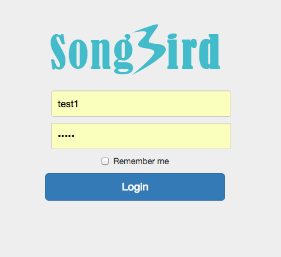
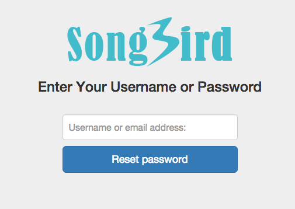
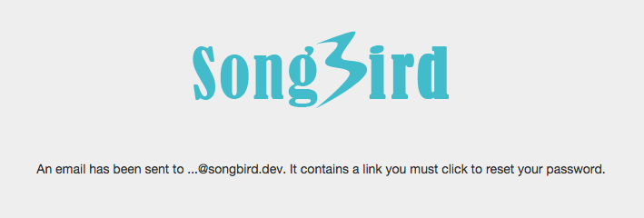
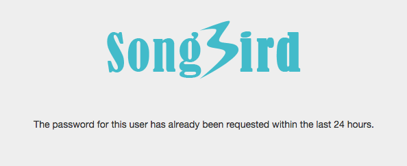
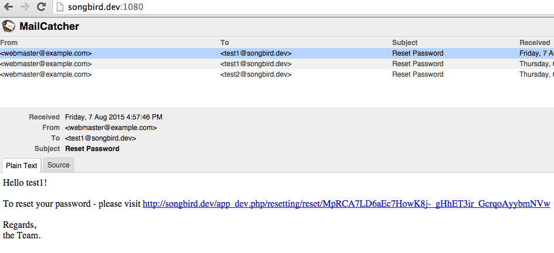
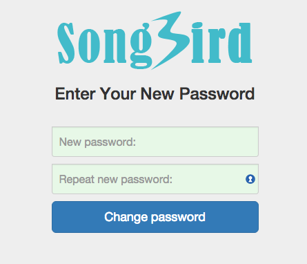

# Chapter 11: Customising the Login Process

In the previous chapters, we have created the admin area and wrote tests for managing users in the admin area. The login page and admin area is still looking plain at the moment. There are still lots to do but let us take a break from the backend logic and look at frontend templating. Symfony is using twig as the default templating engine. If you new to twig, have a look at [twig](http://http://twig.sensiolabs.org/doc/templates.html) website. In this chapter, we will touch up the login interface.

## Defining User Stories and Scenarios

**11. Reset Password**

|**Story Id**|**As a**|**I**|**So that I**|
|11.1|test1 user|want to reset my password without logging in|have a way to access my account in case I forget or loses my password.|

**Story ID 11.1: As a test1 user, I want to be able to reset my password without logging in, so that I have a way to access my account in case I forget or loses my password.**

|**Scenario Id**|**Given**|**When**|**Then**|
|11.1.1|Reset Password Successfully|I click on forget password in the login page and go through the whole resetting process|I should be redirected to the dashboard.|

## Customise the Login Page

I have installed [twitter bootstrap](http://getbootstrap.com/) in the public dir and created a simple logo for Songbird. You can get all the files by checking out from chapter_11 repo. My Resources dir looks like this:

```
# src/AppBundle/Resource

public/
├── css
│   ├── bootstrap-theme.css
│   ├── bootstrap-theme.css.map
│   ├── bootstrap-theme.min.css
│   ├── bootstrap-theme.min.css.map
│   ├── bootstrap.css
│   ├── bootstrap.css.map
│   ├── bootstrap.min.css
│   ├── bootstrap.min.css.map
│   └── signin.css
├── fonts
│   ├── glyphicons-halflings-regular.eot
│   ├── glyphicons-halflings-regular.svg
│   ├── glyphicons-halflings-regular.ttf
│   ├── glyphicons-halflings-regular.woff
│   └── glyphicons-halflings-regular.woff2
├── images
│   └── logo.png
└── js
    ├── bootstrap.js
    ├── bootstrap.min.js
    ├── jquery.min.js
    └── npm.js

```

Let us create our own base layout. The idea is to extend this layout for all twig files that we create in the future.

```
# clean up old files
-> git rm -rf app/Resources/views/user
```

and base.html.twig

```
# app/Resources/views/base.html.twig

<!DOCTYPE HTML>
<html lang="en-US">
<head>
    <meta charset="utf-8">
    <meta http-equiv="X-UA-Compatible" content="IE=edge">
    <meta name="viewport" content="width=device-width, initial-scale=1">
	<title></title>
	
	   <link href="{{ asset('bundles/app/css/bootstrap.min.css') }}" rel="stylesheet" />
    
</head>
<body>


    




    <script src="{{ asset('bundles/app/js/jquery.min.js') }}"></script>
    <script src="{{ asset('bundles/app/js/bootstrap.min.js') }}"></script>


</body>
</html>
```

To override FOSUserBundle template, have a look at the vendors/friendsofsymfony/Resources/views. Thanks to inheritance, we can override login.html.twig based on the layout that we have created.

Let us create the login file
```
-> mkdir -p app/Resources/FOSUserBundle/views/Security
-> touch app/Resources/FOSUserBundle/views/Security/login.html.twig
```

Now the actual login file:

```
# app/Resources/FOSUserBundle/views/Security/login.html.twig




    {{ 'layout.login'|trans({}, 'FOSUserBundle') }}



    {{ parent() }}
    <link href="{{ asset('bundles/app/css/signin.css') }}" rel="stylesheet" />







<div class="container">
    <div class="text-center">
        
            {{ 'layout.logged_in_as'|trans({'%username%': app.user.username}, 'FOSUserBundle') }} |
            <a href="{{ path('fos_user_security_logout') }}">
                {{ 'layout.logout'|trans({}, 'FOSUserBundle') }}
            </a>
        
        <form class="form-signin" action="{{ path("fos_user_security_check") }}" method="post">
            
                <div class="alert alert-danger">{{ error.messageKey|trans(error.messageData, 'security') }}</div>
            

            <input type="hidden" name="_csrf_token" value="{{ csrf_token }}" />

            <input type="text" id="username" name="_username" class="form-control" value="{{ last_username }}" required="required" placeholder="{{ 'security.login.username'|trans }}" />

            <input type="password" id="password" name="_password" class="form-control" required="required" placeholder="{{ 'security.login.password'|trans }}" />

            <div class="checkbox">
              <label>
                    <input type="checkbox" id="remember_me" name="_remember_me" value="on" />{{ 'security.login.remember_me'|trans }}
              </label>
            </div>

            <input class="btn btn-lg btn-primary btn-block" type="submit" id="_submit" name="_submit" value="{{ 'security.login.submit'|trans }}" />
        </form>
    </div>
</div>

```

Once we are done, we can get the assets over to the web dir.

```
-> ./scripts/console assets:install --symlink
```

This command basically [soft linked](https://en.wikipedia.org/wiki/Symbolic_link) everything under the public dir of all bundles over to the document root dir (/web).

Let us go to http://songbird.app:8000/app_dev.php/login and look at our login page now



## Installing Mailcatcher

[Mailcatcher](https://mailcatcher.me/) is excellent for debugging and testing email related functionality. An excellent use case is to test the "forget password" feature.

When using docker, installing a new service is easy (don't need to worry about dependencies). We just need to get a pre-made mailcatcher image and off we go. 

```
# docker-compose.yml
...
    mailcatcher:
        image: yappabe/mailcatcher
        ports:
          - 1025:1025
          - 1080:1080
        networks:
            mynet:
                ipv4_address: 172.25.0.6
```

Now let us fire up the new container
```
# under songbird dir
-> docker-compose down
-> docker-compose up -d
```

We also need to make sure swiftmailer is configured to talk to the new mailcatcher host
```
# symfony/app/config/parameters.yml
# configure based on your own settings

parameters:
    database_host: 172.18.0.2
    database_port: 3306
    database_name: songbird
    database_user: root
    database_password: root
    mailer_transport: smtp
    
    # port 1025 is the mailcatcher sending port    
    mailer_host: '172.25.0.6:1025'
    mailer_user: null
    mailer_password: null
    secret: mysecret
```

## Customise the Request Password Page

A full login process should also include the password reset functionality in case the user forgets his password. Fortunately again, FOSUSerBundle has all these features built-in already. We just need to make minor tweaks to the process and customise the templates.

The password reset process is as follows:

1. User goes to the forget password page.
2. User enters the username or email.
3. User gets an email a reset link.
4. User clicks on the email and goes to a password reset page.
5. User enters the new password and click submit.
6. User automatically gets redirected to the dashboard.

We will put a link on the login page to the request password page. We can find all the links from the debug:router command (a command you should be familiar by now)

```
-> ./scripts/console debug:router | grep fos
  fos_user_security_login          GET|POST   ANY      ANY    /login                             
  fos_user_security_check          POST       ANY      ANY    /login_check                       
  fos_user_security_logout         GET|POST   ANY      ANY    /logout                            
  fos_user_resetting_request       GET        ANY      ANY    /resetting/request                 
  fos_user_resetting_send_email    POST       ANY      ANY    /resetting/send-email              
  fos_user_resetting_check_email   GET        ANY      ANY    /resetting/check-email             
  fos_user_resetting_reset         GET|POST   ANY      ANY    /resetting/reset/{token} 
```

Let us add the new request password link

```
# app/Resources/FOSUserBundle/views/Security/login.html.twig
...
  <input class="btn btn-lg btn-primary btn-block" type="submit" id="_submit" name="_submit" value="{{ 'security.login.submit'|trans }}" />

  <div class="checkbox">
    <a href="{{ path('fos_user_resetting_request') }}">forget password</a>
  </div>
...
```

By looking at vendors/friendsofsymfony/Resources/views, we can create all the required twig files to override.

```
-> cd app/Resources/FOSUserBundle/views/
-> mkdir Resetting
-> touch Resetting/checkEmail.html.twig
-> touch Resetting/passwordAlreadyRequested.html.twig
-> touch Resetting/request.html.twig
-> touch Resetting/reset.html.twig
```

Let us create the request password page based on the base.twig.html that we have created earlier.

```
# app/Resources/FOSUserBundle/views/Resetting/request.html.twig






    {{ 'resetting.request.submit'|trans }}



    {{ parent() }}
    <link href="{{ asset('bundles/app/css/signin.css') }}" rel="stylesheet" />





<div class="container">
    <div class="text-center">
        <h3>Enter Your Username or Password</h3>
        <form class="form-signin" action="{{ path('fos_user_resetting_send_email') }}" method="post">
            
                <div class="alert alert-danger">{{ 'resetting.request.invalid_username'|trans({'%username%': app.request.get('username')}) }}</div>
            
            <input type="text" id="username" name="username" class="form-control" required="required" value="{{ app.request.get('username') }}" placeholder="{{ 'resetting.request.username'|trans }}" />

            <input class="btn btn-lg btn-primary btn-block" type="submit" id="_submit" name="_submit" value="{{ 'resetting.request.submit'|trans }}" />
        </form>
    </div>
</div>

```

From the login page, click on the forget password link and you should go to the request password page



Likewise we are going to customise the password request success message.

```
# app/Resources/FOSUserBundle/views/Resetting/check_email.html.twig






    {{ 'resetting.request.submit'|trans }}



    {{ parent() }}
    <link href="{{ asset('bundles/app/css/signin.css') }}" rel="stylesheet" />




    

    <div class="container">
        <h3> </h3>
        <div class="text-center">
            {{ 'resetting.check_email'|trans({'%tokenLifetime%': tokenLifetime}) }}
        </div>
    </div>

```

A successful password request looks like this:



What if you request password reset more than once in a day? FOSUserBundle actually doesn't allow you to do that. 

A screenshot of the password already requested error:



When the password request email is send successfully, the user should request a link to reset the password. Our mailcatcher is configured to capture all emails fired.

Let us go to

```
http://songbird.app:1080
```



If you click on the link, you will go to the actual reset page to enter the new password.



Try entering a new password and see what happens. Nothing? Because we haven't add the reset.html.twig. Let us do it now.

```
# app/Resources/FOSUserBundle/views/Resetting/reset.html.twig






    {{ 'resetting.request.submit'|trans }}



    {{ parent() }}
    <link href="{{ asset('bundles/app/css/signin.css') }}" rel="stylesheet" />




    

    <div class="container">
        <div class="text-center">
            <h3>Enter Your New Password</h3>
            <form class="form-signin" action="{{ path('fos_user_resetting_reset', {'token': token}) }}" method="post">

                
                    <div class="alert alert-danger">
                        {{ 'fos_user.password.mismatch' | trans({}, 'validators') }}
                    </div>
                

                {{ form_widget(form._token) }}
                <input type="password" id="fos_user_resetting_form_plainPassword_first" name="fos_user_resetting_form[plainPassword][first]" class="form-control" required="required" placeholder="{{ 'form.new_password'|trans }}" />

                <input type="password" id="fos_user_resetting_form_plainPassword_second" name="fos_user_resetting_form[plainPassword][second]" class="form-control" required="required" placeholder="{{ 'form.new_password_confirmation'|trans }}" />

                <input class="btn btn-lg btn-primary btn-block" type="submit" id="_submit" name="_submit" value="{{ 'resetting.reset.submit'|trans }}" />
            </form>

        </div>

    </div>

```

After you entering the new password and clicking submit, FOSUserBundle will try to redirect you to the fos_user_profile_show route (the profile page which we deleted earlier in route.yml). Since the route no longer exists, you will get an error saying the route no longer exists.

To see what is going on, have a look at  vendors/friendsofsymfony/user-bundle/Controller/ResettingController.php::resetAction function. The redirection magic happens after successful form submission.

```
# vendors/friendsofsymfony/user-bundle/Controller/ResettingController.php

namespace FOS\UserBundle\Controller;
...
if ($form->isValid()) {
    $event = new FormEvent($form, $request);
    $dispatcher->dispatch(FOSUserEvents::RESETTING_RESET_SUCCESS, $event);

    $userManager->updateUser($user);

    if (null === $response = $event->getResponse()) {
        $url = $this->generateUrl('fos_user_profile_show');
        $response = new RedirectResponse($url);
    }

    $dispatcher->dispatch(FOSUserEvents::RESETTING_RESET_COMPLETED, new FilterUserResponseEvent($user, $request, $response));

    return $response;
}
...
```

Let's say we want to change the redirection to user's dashboard after successful form submission. What can we do?

## Customise the Reset Password Process

We noted that the system dispatches a FOSUserEvents::RESETTING_RESET_SUCCESS event after the form submission is successful. This give us the opportunity to change the response so that the whole redirection logic could be skipped.

Let us update the subscriber class to do our own redirection.
```
# src/AppBundle/EventListener/AppSubscriber.php

...
use FOS\UserBundle\FOSUserEvents;
use FOS\UserBundle\Event\FormEvent;
use Symfony\Component\HttpFoundation\RedirectResponse;
...

    /**
     * @return array
     */
    public static function getSubscribedEvents()
    {
        // return the subscribed events, their methods and priorities
        return array(
            ...
            FOSUserEvents::RESETTING_RESET_SUCCESS => 'redirectUserAfterPasswordReset'
        );
    }

    ...

    /**
     * Redirect user to another page after password reset is success
     *
     * @param  Configure $event GetResponseUserEvent
     * @return null
     */
    public function redirectUserAfterPasswordReset(FormEvent $event)
    {
        $url = $this->container->get('router')->generate('admin');
        $event->setResponse(new RedirectResponse($url));
    }
    ...

```

Now try to go through the full password reset functionality and see if it works for you.

If everything goes well, you should be redirected to the admin dashboard after the password is reset successfully. Its OK if the dashboard is access denied at the moment.

## Update BDD (Optional)

Based on the user story, let us create a new cest file

```
# in symfony dir
-> vendor/bin/codecept generate:cest acceptance As_Test1_User/IWantToResetPasswordWithoutLoggingIn -c src/AppBundle
```

To automate the checking of emails, we need the mailcatcher module for codeception. Let us update composer

```
-> ./scripts/composer require captbaritone/mailcatcher-codeception-module "1.*" --dev
```

Let us now update the acceptance.suite.yml to use the new mailcatcher library

```
# src/AppBundle/tests/acceptance.suite.yml
class_name: AcceptanceTester
modules:
    enabled:
        - WebDriver:
            url: 'http://songbird.app'
            host: 172.25.0.5
            port: 4444
            browser: phantomjs
            window_size: 1024x768
            capabilities:
                unexpectedAlertBehaviour: 'accept'
                webStorageEnabled: true
        - MailCatcher:
                url: 'http://172.25.0.6'
                port: '1080'
        - \Helper\Acceptance
```

we can now rebuild the libraries
```
# this command will create the mail functions for us to use
-> vendor/bin/codecept build -c src/AppBundle
```

Do a git diff to see all the mail functions added if you want.

```
-> git diff src/AppBundle/tests/_support/_generated/AcceptanceTesterActions.php
```

See the [mailcatcher module](https://github.com/captbaritone/codeception-mailcatcher-module) for more information.

Let us write the Cest file:

```
#src/AppBundle/tests/acceptance/As_Test1_User/IWantToResetPasswordWithoutLoggingInCest.php

namespace As_Test1_User;
use \AcceptanceTester;
use \Common;

/**
 * AS test1 user
 * I WANT to reset my password without logging in
 * SO THAT have a way to access my account in case I forget or loses my password.
 *
 * Class IWantToResetPasswordWithoutLoggingInCest
 * @package As_Test1_User
 */
class IWantToResetPasswordWithoutLoggingInCest
{
    public function _before(AcceptanceTester $I)
    {
    }

    public function _after(AcceptanceTester $I)
    {
    }

    protected function login(AcceptanceTester $I, $username=TEST1_USERNAME, $password=TEST1_PASSWORD)
    {
        Common::login($I, $username, $password);
    }

    /**
     * GIVEN Reset Password Successfully
     * WHEN I click on forget password in the login page and go through the whole resetting process
     * THEN I should be redirected to the dashboard.
     *
     * Scenario 11.1.1
     * @param AcceptanceTester $I
     */
    public function resetPasswordSuccessfully(AcceptanceTester $I)
    {
        // reset emails
        $I->resetEmails();
        $I->amOnPage('/login');
        $I->click('forget password');
        $I->fillField('//input[@id="username"]', 'test1');
        $I->click('_submit');
        $I->canSee('It contains a link');

        // Clear old emails from MailCatcher
        $I->seeInLastEmail("Hello test1");
        $link = $I->grabFromLastEmail('@http://(.*)@');
        $I->amOnUrl($link);

        // The password has been reset successfully
        $I->fillField('//input[@id="fos_user_resetting_form_plainPassword_first"]', '1111');
        $I->fillField('//input[@id="fos_user_resetting_form_plainPassword_second"]', '1111');
        $I->click('_submit');
        // at dashbpard, i should see access denied
        $I->canSee('403');
        // now at show page
        $I->amOnPage('/admin/?action=show&entity=User&id=2');
        $I->canSee('The password has been reset successfully');

        // now login with the new password
        $this->login($I, TEST1_USERNAME, '1111');

        // db has been changed. update it back
        $I->amOnPage('/admin/?action=edit&entity=User&id=2');
        $I->fillField('//input[contains(@id, "_plainPassword_first")]', TEST1_USERNAME);
        $I->fillField('//input[contains(@id, "_plainPassword_second")]', TEST1_PASSWORD);
        $I->click('//button[@type="submit"]');
        // i am on the show page
        $I->canSeeInCurrentUrl('/admin/?action=show&entity=User&id=2');

        // i not should be able to login with the old password
        $this->login($I);
        $I->canSee('403');
    }
}
```

ready for testing?

```
-> scripts/runtest As_Test1_User/IWantToResetPasswordWithoutLoggingInCest.php
```

## Summary

We have updated the aesthetics of the Login and request password change pages. By listening to the reset password event, we redirected user to the dashboard when the event is triggered. Finally, we wrote BDD tests to make sure this functionality is repeatable in the future.

## Exercises

* (Optional) Try to be fancy with the login layout and css. How do you use FOSUserBundle's layout.html.twig?

## References

* [Twig Templating](http://twig.sensiolabs.org/doc/templates.html)

* [Overriding FOSUserBundle Templates](http://symfony.com/doc/master/bundles/FOSUserBundle/overriding_templates.html)

* [FOSUserBundle Emails](http://symfony.com/doc/current/bundles/FOSUserBundle/emails.html)

* [Codeception Mailcatcher Module](https://github.com/captbaritone/codeception-mailcatcher-module)
