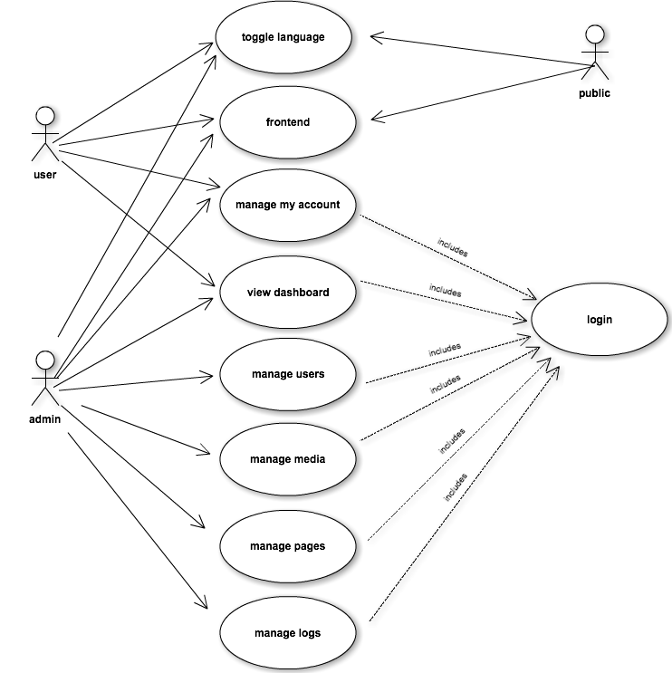
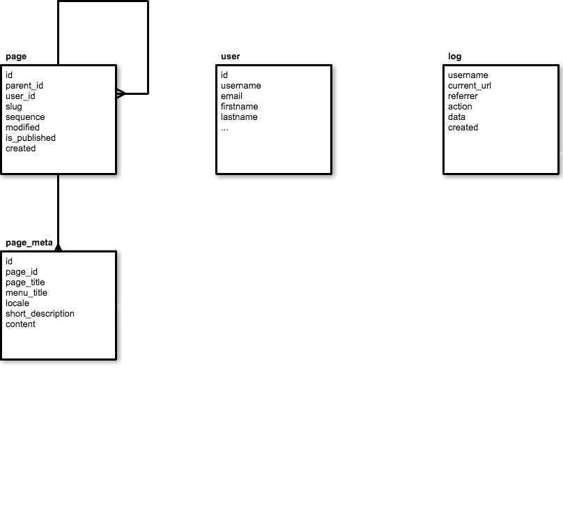
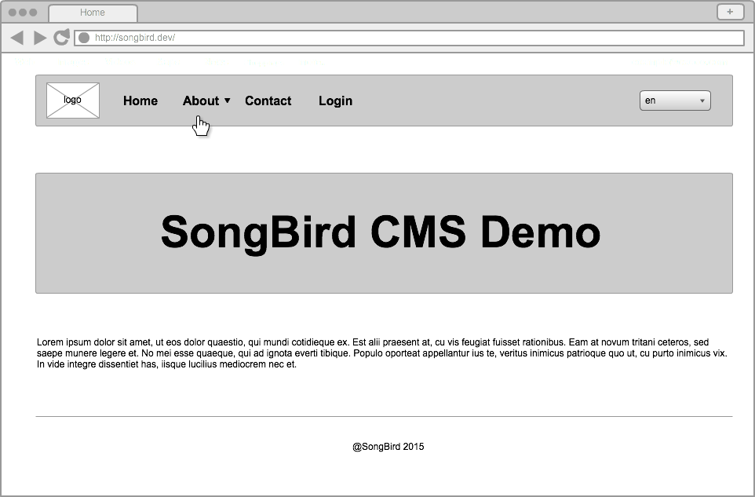
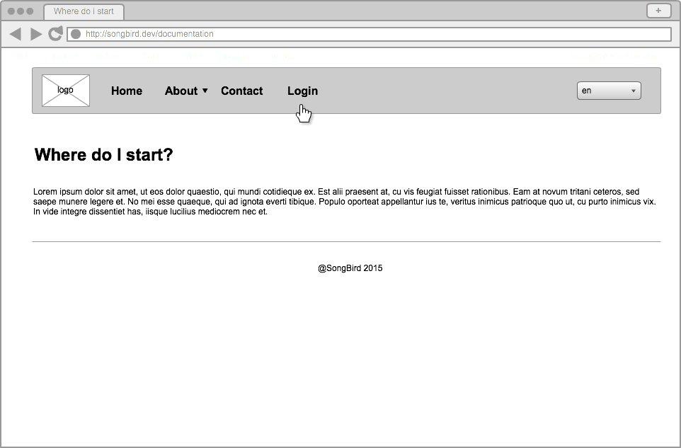
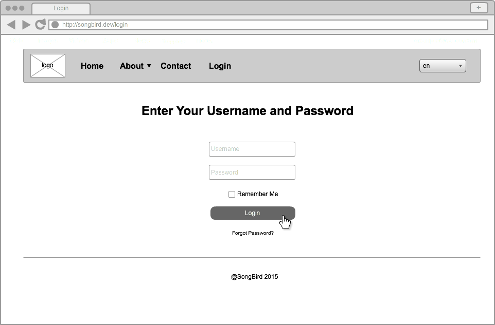
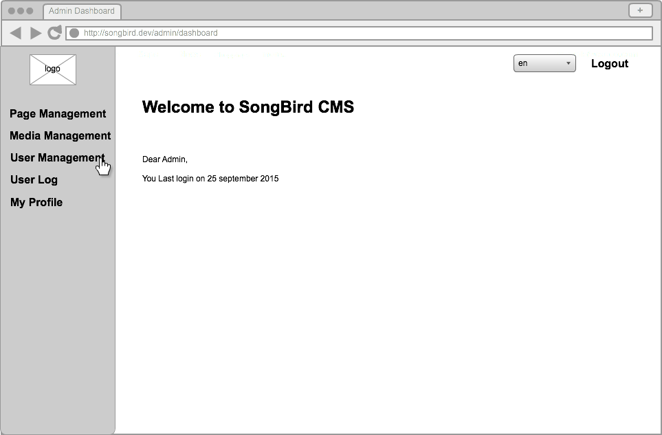
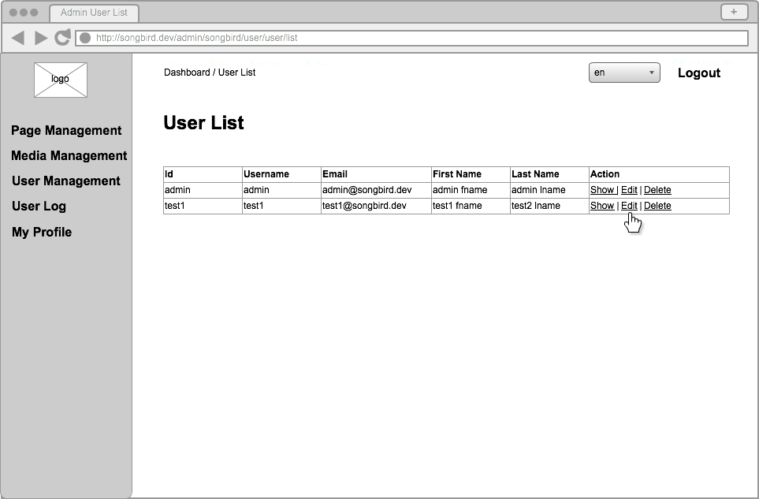
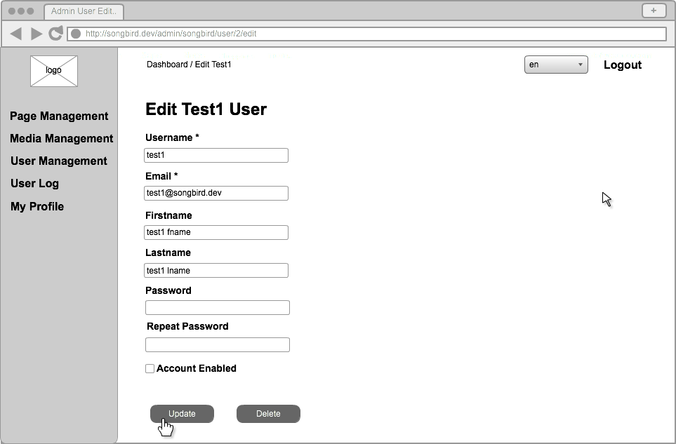
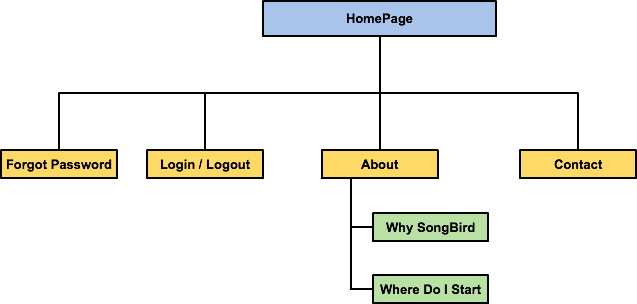

# Chapter 2: What is SongBird

In a nutshell, SongBird is a bare bone CMS (Content Management System) consisting the following features:

* Admin Panel and Dashboard - A password protected administration area for administrators and users.
* User Management System - For administrators to manage users of the system.
* i18n Capability - Multi-lingual. No CMS is complete without this.
* Page Management System - For managing the front-end menu, slug and content of the site.
* User Logging Sytem - For logging user activities in the backend.
* Frontend - The portal where the public interacts with the site. No login required.

We will attempt to built the CMS using some popular modules available to cut down the development time. This is the best approach. However, that also means that we lose the fun of building some cool bundles ourselves. In view of that, we will attempt to build the Page management bundle and frontend ourselves.

## So What is the Plan?

In this chapter we are going to define the scope of the software. People spend weeks to write a proper functional specification for a software like this. Functional Specification defines the scope of the project, provides an estimate of the amount of man hours required and duration to complete the job, gives people an idea of what the software is, what it can or can't do. It is also important to use that as a reference when writing test cases as well.

Writing good functional specs is the most important part of the Software Development Life Cycle. In our case, we shall cut down the words and show only relevant information in developing SongBird.

## Use Case Diagram

This is a high level overview of the roles and features of SongBird.

## Database Diagram

The entity relationships in a nutshell. In the real world, the relationships won't be that simple. You should see more one-to-many and many-to-many relationships.

## User Journey

This is how I visualise a user would interact with the website. Hopefully, it gives you confidence of what we are about to build.

a) The frontend homepage:

b) The frontend subpage:

c) The login page:

d) Backend dashboard:

d) Backend listing page:

e) Backend record edit page:

We haven't started coding but you already have a realistic view of the final product.

## Sitemap

We are going to start with a few pages only, keeping the navigation simple.

## User Stories

A user story defines the functionality that the user wants to have in plain english. We don't want to drill down to specifics at this stage. The specifics should be in the user scenarios. We make use of "As a", "I want/don't want to" and "So that" to help define good user stories.

As an example:

"As a developer, I want to create a simple CMS, so that I can use it as a vanilla CMS for more complex projects".

We will define the user stories for each chapter as we go along.

## User Scenarios

User Scenarios break the user story down into further possible outcomes. I like to think of them as pseudocode. We make use of "Given", "When" and "Then" to define user scenarios. BDD tests are written based on these scenarios. Based on the example above, Possible scenarios are:

"Given the homepage, When I land on the homepage, Then I should see a big welcome text."

"Given the about us page, When I navigate to the about us page from the menu, Then I should see my name"

We will define the user scenarios based on the user stories for each chapter as we go along.

## Summary

In this chapter, we tried to define what SongBird is and isn't. We defined the requirements and provided some use cases/diagrams to help define the end product. In real life, requirement docs could be a lot longer. Having well defined requirements is paramount in building robust software.

## References

* [User Story](https://en.wikipedia.org/wiki/User_story)

* [Functional Specification](https://en.wikipedia.org/wiki/Functional_specification)

